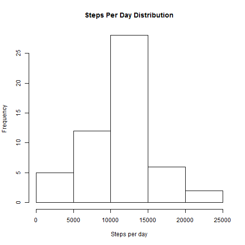
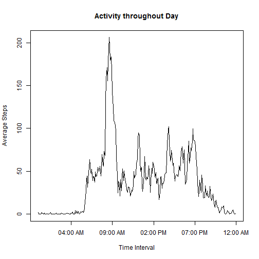
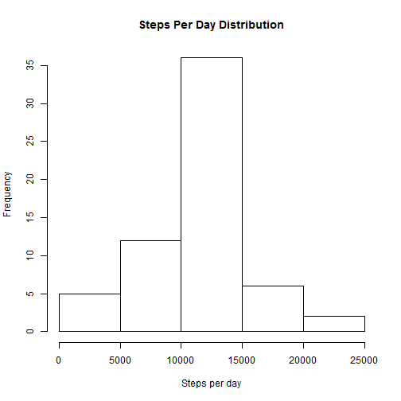
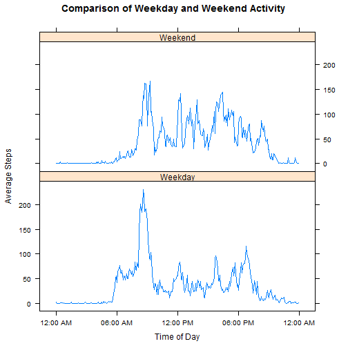

Reproducable Research Project 1
========================================================
## Introduction

This R program was written for Project 1 in the Coursera Reproducible Research class.
It reads in a data file that contains activity data, measured in steps, recorded in 5
minute intervals over a number of days. I will be looking at the distribution of the
total steps taken each day, as well as the averages of each time interval across every
day.

## Data Input and Analysis of Steps per Day

The input data file activity.csv needs to be located in the run directory. The file can
be obtained from the following location:

https://d396qusza40orc.cloudfront.net/repdata%2Fdata%2Factivity.zip

I am using the R aggregate function to sum the data for each day.


```r
actraw <- read.csv("activity.csv")
actday <- aggregate(actraw$steps ~ actraw$date, FUN=sum)
names(actday) <- c("Date","TotalSteps")
```

The histogram below is being drawn with the R base graphics package. It indicates that
the distribution of average steps per day is nearly normal. For the calculation of the
mean, it is necessary to specify that NA values are removed. The mean and
median are very close to each other.


```r
hist(actday$TotalSteps, xlab="Steps per day", main="Steps Per Day Distribution")
```

 

```r
cat("The mean number of steps per day is: ", mean(actday$TotalSteps,na.rm=TRUE), "\n")
```

```
## The mean number of steps per day is:  10766
```

```r
cat("The median number of steps per day is: ", median(actday$TotalSteps), "\n")
```

```
## The median number of steps per day is:  10765
```

## Analysis of Average Steps per Interval

Again I am using the R aggregate function to group the data, by interval time. For the
plot, I am converting the interval value toa POSIX time value, so that
the plots are smoother without the gap between 60 and 100. The R base graphics package is
being used to draw the time series of steps versus 5-minute time interval, and I'm also
explicitly printing the time value where the maximum average steps occur.


```r
actint <- aggregate(actraw$steps ~ actraw$interval, FUN=mean)
names(actint) <- c("Interval","AvgSteps")
actint$IntervalTime <- as.POSIXct(sprintf("%04d",actint$Interval),format="%H%M")

plot(actint$IntervalTime,actint$AvgSteps,type="l",xaxt="n",
    main="Activity throughout Day",xlab="Time Interval",ylab="Average Steps")
axis.POSIXct(1,actint$IntervalTime,format="%I:%M %p")
```

 

```r
cat("The maximum number of steps occurs on average at ",
    format(actint[actint$AvgSteps == max(actint$AvgSteps),'IntervalTime'],
    format="%I:%M %p"), "\n")
```

```
## The maximum number of steps occurs on average at  08:35 AM
```

## Adjusted Data

I am using the total interval average calculated above to fill in the values that were
not measured/defined within the range of days in the data set. To make the coding more
clear, I separated the defined and undefined values, and used the match function with
the total interval average to substitute in average values. I then merge the sets of
data back together, reorder, and draw the histogram and display the mean and median as
above.

As one might expect, the mean value does not change, the median value becomes the mean,
and the histogram shows a higher number of values near the mean than the histogram
shown earlier.


```r
nastep <- actraw[is.na(actraw$steps),]
nastep$steps <- actint[match(nastep$interval,actint$Interval),2]

actadj <-actraw[!is.na(actraw$steps),]
actadj <- rbind(actadj,nastep)
actadj <- actadj[order(actadj$date,actadj$interval),]

actadjd <- aggregate(actadj$steps ~ actadj$date, FUN=sum)
names(actadjd) <- c("Date","TotalSteps")

hist(actadjd$TotalSteps, xlab="Steps per day", main="Steps Per Day Distribution")
```

 

```r
cat("The adjusted mean number of steps is: ", mean(actadjd$TotalSteps), "\n")
```

```
## The adjusted mean number of steps is:  10766
```

```r
cat("The adjusted median number of steps is: ", median(actadjd$TotalSteps), "\n")
```

```
## The adjusted median number of steps is:  10766
```

## Weekday/weekend comparison

In this section, I use the weekdays function determine the day of the week from
the date, set a factor variable for the weekday/weekend designation to be weekdays
by defaut, and then use a logical expression to specify the weekends. I use a two
variable aggregate function to find averages for every time interval for both the
weekdays and weekends, convert the time to POSIX, and then use the lattice xyplot
function to display the data in two panels.

The graph indicates that there is a clear difference between weekday and weekend
activity. On weekdays, there is a pronounced spike in the morning, probably where
the subject was commuting to work. On weekends, the activity starts a later in the
morning, the early morning spike isn't as great, and there is more activity in the
middle of the day than there is on weekdays.


```r
actadj$Day <- weekdays(as.Date(actadj$date))
actadj$DayType <- "Weekday"
actadj[(actadj$Day == "Saturday" | actadj$Day == "Sunday"),'DayType'] <- 'Weekend'
actadj$DayType <- as.factor(actadj$DayType)
actadji <- aggregate(actadj$steps ~ actadj$interval + actadj$DayType, FUN=mean)
names(actadji) <- c("Interval","DayType","AvgSteps")
actadji$IntervalTime <- as.POSIXct(sprintf("%04d",actadji$Interval),format="%H%M")

library(lattice)

xyplot(AvgSteps ~ IntervalTime | DayType, data=actadji, layout=c(1,2),type="l",
    scales=list(x = list(format = "%I:%M %p")),
    xlab = "Time of Day",
    ylab = "Average Steps",
    main = "Comparison of Weekday and Weekend Activity",
)
```

 
